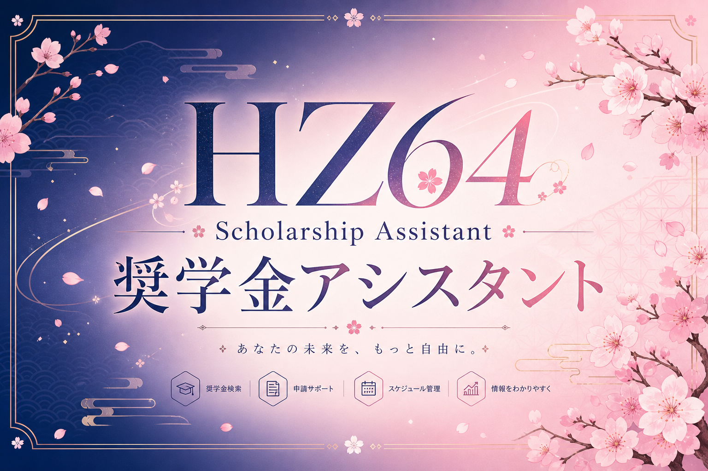
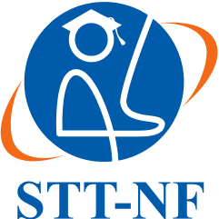

<div align="center">



<br>


<br><br>



<br>

**〔 学生奨学金審査システム 〕**  
**Sistem Penyaringan Berkas Beasiswa Mahasiswa**

`KMIE22002SI` ／ 人工知能 ／ UAS **STT-NF**

<br>

[](https://t.me/hz_64bot)
[](https://n8n.io)
[](index.html)

<br>

**こんにちは!** *(Konnichiwa)* — Halo! Siap bantu cek kelayakan beasiswamu.


</div>

<br>

---

## 〔 はじめに 〕 Pengenalan

Proyek UAS ini menggabungkan **Bot Telegram pintar** dan **simulasi web** untuk menyaring mahasiswa yang layak mendaftar beasiswa.

| 区分 | Komponen | Peran | Bobot |
|:--:|----------|-------|:-----:|
| A | Bot Telegram + n8n | Penyaringan otomatis + AI + Sheets | 45% |
| B | `index.html` | Kalkulator simulasi browser | 45% |
| — | Video demo | Penjelasan sistem | 10% |

---

## 〔 条件 〕 Syarat Lolos

> **合格条件** — Kedua syarat harus terpenuhi untuk *Lolos Seleksi Awal*.

| 項目 | Kriteria | Nilai |
|------|----------|-------|
| IPK | 最小値 | **≥ 3.30** |
| 収入 | 両親の月収 | **≤ Rp 5.000.000** |

---

## 〔 挨拶 〕 Gaya Bot HZ64

<table>
<tr>
<td width="110"></td>
<td>

| 場面 | Balasan Bot |
|------|-------------|
| `/start` | `Halo @user!` ＋ **こんにちは! (Konnichiwa)** |
| 合格 | `Selamat @user!` ＋ **おめでとう (Omedetou)** |
| 不合格 | `Tetap semangat!` ＋ **頑張れ! (Ganbare)** |

</td>
</tr>
</table>

**例 · 合格メッセージ**

```
🎉 Selamat, Sugino!
おめでとう (Omedetou)

Berkas Anda dinyatakan Lolos Seleksi Awal.

📊 IPK: 3.52
💰 Pendapatan: Rp 4.500.000

Data sudah tersimpan di Google Sheets ✅
```

---

## 〔 構成 〕 Struktur Proyek

```
├── assets/
│   ├── readme-header.png       # Header JP typography
│   ├── hz64-banner.png         # Banner almamater STT-NF
│   ├── hz64-mascot.png         # Mascot assistant
│   └── sttnf-logo.png          # Logo resmi STT-NF
├── index.html
├── n8n-workflow-beasiswa.json
├── bot/
├── package.json
└── README.md
```

---

## 〔 Part A 〕 Bot Telegram ＋ n8n

### 処理フロー · Alur Workflow

```
Telegram Trigger → Router Menu → AI Agent → Parse & Cek
                                    → If Lolos?
                                       ├─ Yes → Google Sheets → Balas Lolos
                                       └─ No  → Balas Tidak Lolos
```

### 機能 · Fitur

- Tombol berwarna **primary / success / danger**
- **Demo Lolos** ＆ **Demo Tidak Lolos**
- Ekstraksi teks bebas via **AI Agent**
- Data lolos → **Google Sheets**
- Nama lengkap user di balasan

### Setup n8n

1. Token bot dari [@BotFather](https://t.me/BotFather)
2. Import `n8n-workflow-beasiswa.json` → [n8n Cloud](https://n8n.io)
3. Credential: **Telegram** · **OpenAI** · **Google Sheets**
4. Mapping Sheets (mode **fx**):

   | Kolom | Expression |
   |-------|------------|
   | Nama | `$json.nama` |
   | IPK | `$json.ipk` |
   | Pendapatan | `$json.pendapatan` |
   | Status | `Lolos Seleksi Awal` |
   | Waktu | `$now.toFormat('dd/MM/yyyy HH:mm')` |

5. **Active ON**

### テスト · Skenario Uji

| Input | 結果 |
|-------|------|
| `IPK saya 3.52 dan pendapatan orang tua 4.5 juta` | 合格 · masuk Sheets |
| `IPK saya 3.10 dan gaji orang tua 3 juta` | 不合格 · tidak masuk Sheets |

---

## 〔 Part B 〕 Simulasi Web

Buka `index.html` di browser.

<div align="center">
  
  <br><br>
  <sub>桜アニメーション · マスコット · パステルテーマ</sub>
</div>

### Branding

- Header: **HZ64 Scholarship Assistant**
- Footer: *Powered by HZ64 Scholarship Bot · AI Eligibility Checker*
- Lolos → daftar **@hz_64bot**

### ロジック · Logika

```javascript
if (ipk >= 3.3 && pendapatan <= 5000000) {
  // 合格 — Layak daftar via @hz_64bot
} else {
  // 不合格
}
```

---

## 〔 提出 〕 Pengumpulan UAS

Arsip: `nim_nama_uas_AI.zip`

- [ ] `index.html`
- [ ] `n8n-workflow-beasiswa.json`
- [ ] [t.me/hz_64bot](https://t.me/hz_64bot)
- [ ] Video demo ≤ 3 menit

---

## 〔 技術 〕 Teknologi

| 技術 | 用途 |
|------|------|
| n8n | Workflow otomasi |
| Telegram Bot API | Chat interface |
| OpenAI | AI ekstraksi data |
| Google Sheets | Database lolos |
| HTML · CSS · JS | Simulasi web |

---

<div align="center">


&nbsp;&nbsp;


<br><br>

**Powered by HZ64 Scholarship Bot · AI Eligibility Checker**

**がんばって!** *(Ganbatte)* — Semangat untuk beasiswamu!

<br>

MIT License · UAS STT-NF · KMIE22002SI

</div>
